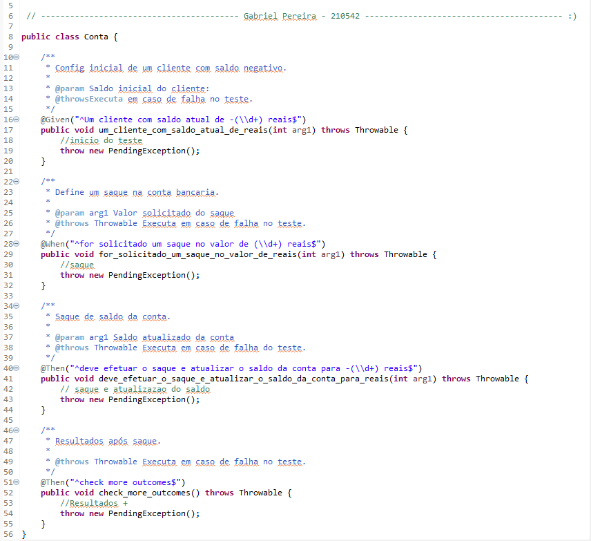
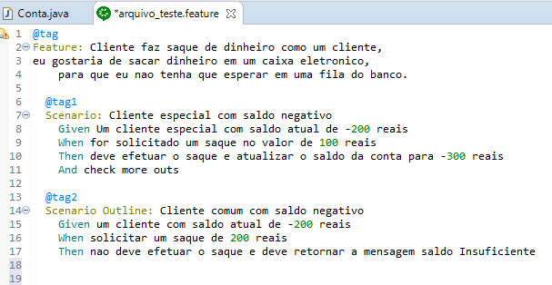
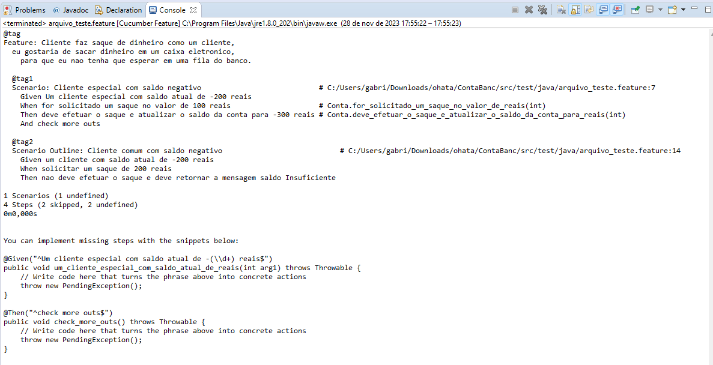
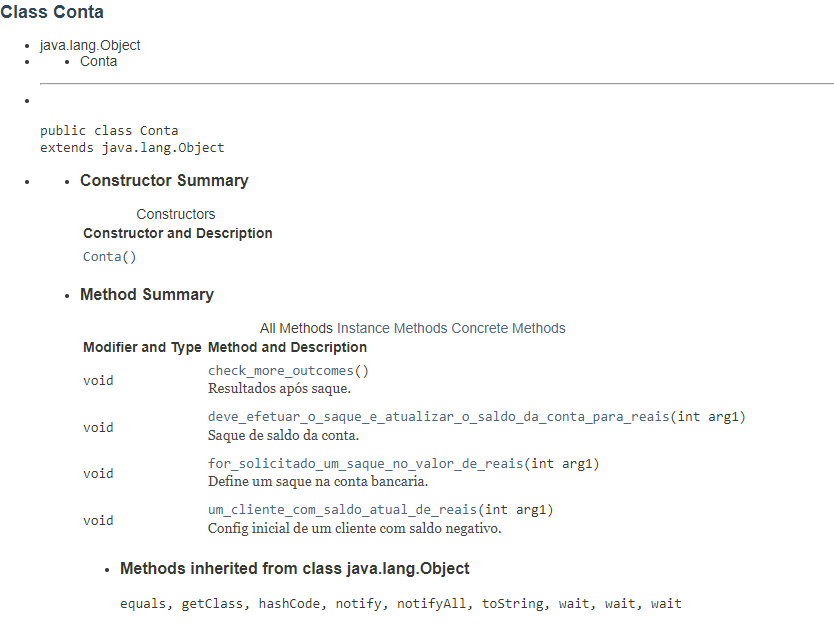
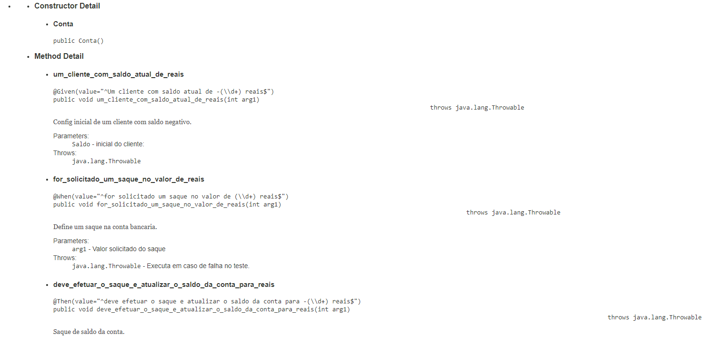

# AF - Qualidade e Testes de Softwares

Projeto final para entrega de um projeto de uma conta bancária utilizando Java e Cucumber.

# Codigo da classe CONTA

# Codigo Cucumber

# Tecnologias utilizadas

<ul>
    <li>Java</li>
    <li>Cucumber</li>
    <li>Eclipse IDE</li>
</ul>

# Resultado Console

# JAVADOC file

# Ultima atualizacao 28/11/2023

# RA: 210542

#Conta_Bancaria
# Conta_Bancaria
# Conta_Bancaria
